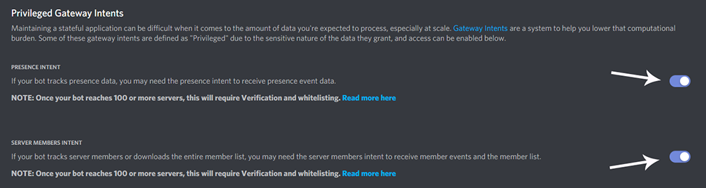

# 🍈 melonBot

> melonBot is a Discord bot that can add/remove roles from message reactions.

## 📃 About
melonBot was originally made for a friend, but I see no reason why others can't benefit from this bot too.

## 🔐 Bot Permissions
The Discord bot requires certain global permissions in your server to be able to work properly:

- View Channels
- Manage Roles
- Send Messages
- Embed Links
- Add Reactions
- Manage Messages
- Read Message History

This bot also accepts Role ID's, @RoleMentions as well as Role names, [Role names can be an issue if you have 2 roles with the same name that you want to add, in that case I would use @RoleMention or Role ID]; To take full advantage of this feature of the bot, please enable `PRESENCE INTENT` and `SERVER MEMBERS INTENT`. This will allow the bot to collect Cache for guild members.

## 📡 Command List

### Administrator Commands
| Name | Commands | Description |
| ---- | -------- | ----------- |
| **Message React** | `r$messagereact <optional: remove> <MessageID>` | Setup the message for react for roles. |

> **Notice:** This bot will only accept commands from an account with the Administrator Global permission.

## ⚙️ Install
### Install with Nodejs

**Dependencies Install**

	npm install

**Run**

	npm start

## 🤓 Developer
👤 **Huskies xD**
Twitter: [@HuskiesxD](https://twitter.com/HuskiesxD)
Github: [@AlexHuskiesMercer](https://github.com/AlexHuskiesMercer)
Discord: [Huskies xD#6455](https://discord.com/users/213310816231882752)

## **Big Thanks to**
Discord: [Watermelon Man#0666](https://discord.com/users/656929712391585832)

## 📑 MIT Licensing
MIT License. Copyright (c) 2021 Alex Huskies
